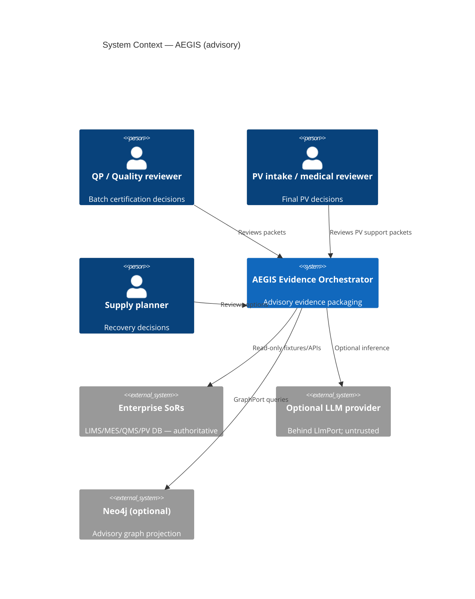

# 14 — Architecture (C4) & Architecture Decision Records

| Field | Entry |
|---|---|
| Owner | Architecture lead |
| Version / date | 1.0.0 / 2026-08-10 |
| Status | Phase 5 — advisory hybrid architecture locked |
| Sources | [`SCQA.md`](SCQA.md), `05`, `08`, `11`, `17`, `Docs/specs/Engineering/TYPED_CONTRACTS_PORTS_FASTAPI.md` |

---

## 1. Context (C4 Level 1)

NovaCura operates fragmented systems of record (LIMS, MES, eBR, QMS, safety DB, serialisation, cold-chain, RIM). Accountable humans must assemble defensible evidence for batch review, PV intake and supply recovery under inspection and cyber pressure ([`SCQA.md`](SCQA.md) Complication).

**AEGIS Evidence Orchestrator** sits as an **advisory orchestration layer**: read-only SoR access, contract-valid packets, human review, audit export — never disposition, final PV, allocation, shipment or recall (`NN-01`..`03`).



---

## 2. Container diagram (C4 Level 2)

| Container | Technology | Responsibility |
|---|---|---|
| **Review UI** | React (SPA) | Human review gates G-HR-01..06; **no** execute controls for regulated acts |
| **API** | FastAPI + OpenAPI | AuthZ, workflow endpoints, graph proxy, audit emit |
| **Application core** | Python 3.11+ | Orchestration, reconciliation rules, prohibited-action guards |
| **Ports layer** | Protocols in `aegis.ports` | `FixturePort`, `AuthorityPort`, `GraphPort`, `LlmPort`, `AuditPort`, `TelemetryPort`, `ToolManifestPort` |
| **Adapters** | CSV loaders, Neo4j, console telemetry, stubs | Swappable; offline defaults to fakes |
| **CLI** | `aegis.cli` | Deterministic offline runs for PUB evaluation |
| **SoR fixtures** | `data/*.csv` | **Authoritative** challenge evidence (immutable outside submission policy) |
| **Knowledge catalog** | `knowledge/` + `AuthorityPort` | Trust states; not a fact SoR |
| **Neo4j** | Optional | Derived advisory subgraph only |
| **Eval / contracts** | JSON Schema + pytest | Pre-inference gates |

```text
[React Review UI] --HTTPS--> [FastAPI API] --> [Application services]
                                  |                    |
                                  v                    v
                           [Port interfaces] <-- [Adapters: fixture, authority, graph, llm, audit, telemetry, tools]
                                  |
                    +-------------+-------------+
                    v             v             v
              data/*.csv    InMemoryGraphStub   OfflineLlmStub
                            or Neo4j adapter
```

---

## 3. Component highlights (C4 Level 3 — selected)

| Component | Location (submission) | Notes |
|---|---|---|
| Prohibited action guard | `domain/prohibited.py` | Fail-closed on NN-01..03 patterns |
| Workflow contracts | `contracts/workflows.py`, `evaluation/contracts/` | Pydantic v2 strict models |
| Composition root | `composition.py` | Selects stub vs live adapters from env |
| Graph adapters | `adapters/graph_memory.py`, `graph_neo4j.py` | Parity tests required |
| Tool manifest | `adapters/tool_manifest.py`, `domain/tools.py` | Allow-list + schema binding |
| Telemetry | `telemetry/redaction.py`, `telemetry/console.py` | OTel-compatible hooks |

---

## 4. Architecture Decision Records

### ADR-001 — Hybrid hexagonal core (Python ports + FastAPI + React)

| | |
|---|---|
| **Status** | Accepted |
| **Context** | Need workshop-deliverable advisory orchestration with clear regulated boundary ([`SCQA.md`](SCQA.md) Answer). |
| **Decision** | Implement **hexagonal architecture**: domain/application depend on ports; adapters implement CSV, graph, LLM, audit. Expose **FastAPI** for integration and **React** for human review. |
| **Consequences** | (+) Testability via fakes; strangler-friendly brownfield (`15`). (−) More boilerplate than monolith; team must respect port boundaries. |
| **Links** | D-001, `17` §7, REQ XC-04 |

---

### ADR-002 — Neo4j via GraphPort (advisory projection only)

| | |
|---|---|
| **Status** | Accepted |
| **Context** | Multi-hop genealogy, PV duplicate clusters and cold-chain paths are error-prone in ad-hoc CSV joins (`11`, BAT-03). |
| **Decision** | Adopt **Neo4j behind `GraphPort`** for explainability subgraphs. **CSV SoR remains authoritative**; graph is rebuildable derived state. Mandatory **`InMemoryGraphStub`** for offline/CI. |
| **Consequences** | (+) Clear audit narrative for links. (−) Operational cost if Neo4j treated as SoR — explicitly rejected (ADR-009). |
| **Links** | D-009, `11`, NN-06 |

---

### ADR-003 — Pydantic v2 strict contracts at boundaries

| | |
|---|---|
| **Status** | Accepted |
| **Context** | Regulated evidence must not silently drift shape, units or extra fields at API/packet boundaries (`09`, NN-05). |
| **Decision** | All external payloads use **Pydantic v2** with `model_config = ConfigDict(extra='forbid', strict=True)` (or JSON Schema equivalent for eval). Version response schemas in `evaluation/contracts/`. |
| **Consequences** | (+) Fail-fast on contract violations. (−) Stricter client integration; breaking changes require version bump. |
| **Links** | BAT-01, PV-01, SUP-01, `17` |

---

### ADR-004 — AI-disabled and offline-first default for evaluation

| | |
|---|---|
| **Status** | Accepted |
| **Context** | NN-06 requires continuity without model dependency; workshop must grade deterministically (`16`). |
| **Decision** | **Default composition** uses `OfflineLlmStub` (or rules-only path) + `InMemoryGraphStub`. LLM enablement is explicit env flag with budget caps (`20`). CLI path must pass PUB fixtures without network. |
| **Consequences** | (+) Reproducible evidence. (−) Demo “AI sparkle” requires controlled enablement and disclosure in audit. |
| **Links** | D-003, `21`, PUB-10 |

---

### ADR-005 — OpenTelemetry with redaction and correlation

| | |
|---|---|
| **Status** | Accepted |
| **Context** | Ops need traceability without exfiltrating PV narratives or secrets (`Docs/specs/Engineering/OPENTELEMETRY_TELEMETRY.md`). |
| **Decision** | Implement **`TelemetryPort`** with correlation id per run; span attributes allow-listed; **redact** patient text, tokens, raw lab rows from spans/logs. Console exporter default offline. |
| **Consequences** | (+) Incident/debug without PHI in logs. (−) Limited span detail for deep ML debugging — use secure offline replay instead. |
| **Links** | `35`, XC-03, `30` |

---

### ADR-006 — React human-review UI (review-only, no regulated execute)

| | |
|---|---|
| **Status** | Accepted |
| **Context** | D-004, D-008: UI must not offer disposition, ship, or final PV controls (`06`, `05`). |
| **Decision** | React SPA presents **draft packets**, conflict registers, citations and **export after gate** only. Buttons labelled “Approve for export” record **human** attestation, not AI certification. WCAG-oriented baseline per D-012. |
| **Consequences** | (+) Clear UX boundary. (−) Users may still misread advisory text — mitigated by TEVV and training (`32`, `07`). |
| **Links** | G-HR-01..06, NN-01..03 |

---

### ADR-007 — Versioned tool manifest and allow-listed tools

| | |
|---|---|
| **Status** | Accepted |
| **Context** | Agent/tool loops risk excessive agency (OWASP LLM06/08) and poisoned descriptors (`28`, `29`). |
| **Decision** | **`ToolManifestPort`** serves signed/versioned manifest: tool id, JSON schema for args, max calls, prohibited side-effects flag. Runtime denies unknown tools and schema violations **before** invocation. |
| **Consequences** | (+) Zero-trust tool surface. (−) Slower agent iteration — changes via change control. |
| **Links** | XC-01, XC-05, `19` |

---

### ADR-008 — Fail-closed authorization and abstention

| | |
|---|---|
| **Status** | Accepted |
| **Context** | Concurrent injects break identity, units, clocks and authority (`SCQA.md`, NN-05). |
| **Decision** | At execution time validate **user, purpose, object, role, tool auth**. On stale/ambiguous state or unresolved authority → **abstain** with reason codes; never guess genealogy or convert units. |
| **Consequences** | (+) Defensible under inspection. (−) Higher abstention rate until MDM/authority data quality improves. |
| **Links** | NN-04, NN-05, `12`, BAT-02 |

---

### ADR-009 — No graph or document store as system of record

| | |
|---|---|
| **Status** | Accepted |
| **Context** | Temptation to treat Neo4j or vector DB as “single truth” conflicts with challenge immutability and CSV SoR (`11` §2). |
| **Decision** | **Reject** Neo4j, MongoDB, Elasticsearch or vector index as SoR for batch/PV/supply facts. They may hold **derived** projections and retrieval indexes only; values in packets cite **SoR row ids** first. |
| **Consequences** | (+) Aligns with data governance (`09`). (−) Rebuild jobs needed after SoR corrections. |
| **Links** | D-009, `10`, `24` |

---

### ADR-010 — Read-only SoR integration (fixtures now, APIs later)

| | |
|---|---|
| **Status** | Accepted |
| **Context** | Brownfield NovaCura systems must not receive autonomous writes from AEGIS (`05` §3). |
| **Decision** | **`FixturePort`** loads immutable CSV fixtures in workshop; production pattern is **read-only API clients** with typed retries (`clients/http.py`) — no write-back path in product scope. |
| **Consequences** | (+) Safety. (−) Humans copy exports into authoritative systems manually or via separate approved integrations. |
| **Links** | `15`, XC-04, `37` out-of-scope |

---

### ADR-011 — Optional LLM behind LlmPort (untrusted output)

| | |
|---|---|
| **Status** | Accepted |
| **Context** | Hybrid value case (`02`) without replacing rules-first reconciliation. |
| **Decision** | LLM calls only through **`LlmPort`** with structured output schema, budget/step limits (`20`), and post-validation against contracts. Model output is **untrusted** until schema + grader pass. |
| **Consequences** | (+) Controlled augmentation. (−) Latency/cost — FinOps artefacts `33`/`34`. |
| **Links** | `18`, `19`, `32` |

---

### ADR-012 — Idempotent runs, checkpoints and audit emit

| | |
|---|---|
| **Status** | Accepted |
| **Context** | Retries and partial agent runs must not duplicate side effects or obscure trail (`20`, `24`). |
| **Decision** | Accept **idempotency keys** on workflow start; persist **checkpoints** for multi-step agent paths; **`AuditPort`** emits hash-chained events (run id, adapter modes, packet hash). |
| **Consequences** | (+) ALCOA-friendly replay. (−) Storage for checkpoint blobs in production. |
| **Links** | `20`, `24`, `27` |

---

## 5. ADR index

| ID | Title | Status |
|---|---|---|
| ADR-001 | Hybrid hexagonal core | Accepted |
| ADR-002 | GraphPort / Neo4j advisory | Accepted |
| ADR-003 | Pydantic strict contracts | Accepted |
| ADR-004 | AI-disabled / offline default | Accepted |
| ADR-005 | OpenTelemetry + redaction | Accepted |
| ADR-006 | React review-only UI | Accepted |
| ADR-007 | Tool manifest | Accepted |
| ADR-008 | Fail-closed / abstention | Accepted |
| ADR-009 | No NoSQL/graph SoR | Accepted |
| ADR-010 | Read-only SoR | Accepted |
| ADR-011 | LlmPort optional | Accepted |
| ADR-012 | Idempotency / audit | Accepted |

---

## 6. Requirements trace

| REQ | ADR |
|---|---|
| NN-06 | ADR-004 |
| NN-04, NN-05 | ADR-008 |
| XC-04 | ADR-001, ADR-010 |
| XC-05 | ADR-007, ADR-011, ADR-012 |
| BAT-02 | ADR-003, ADR-008 |

*Refresh RTM section 8 after test paths land in `submission/tests/`.*
