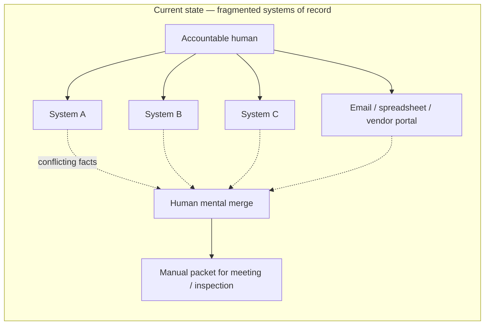
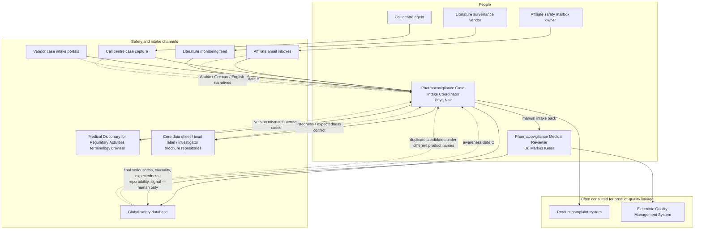
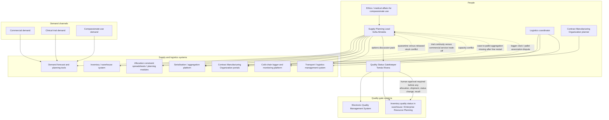
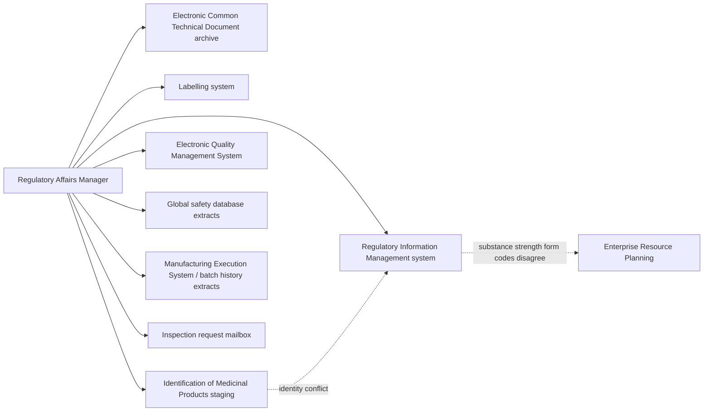
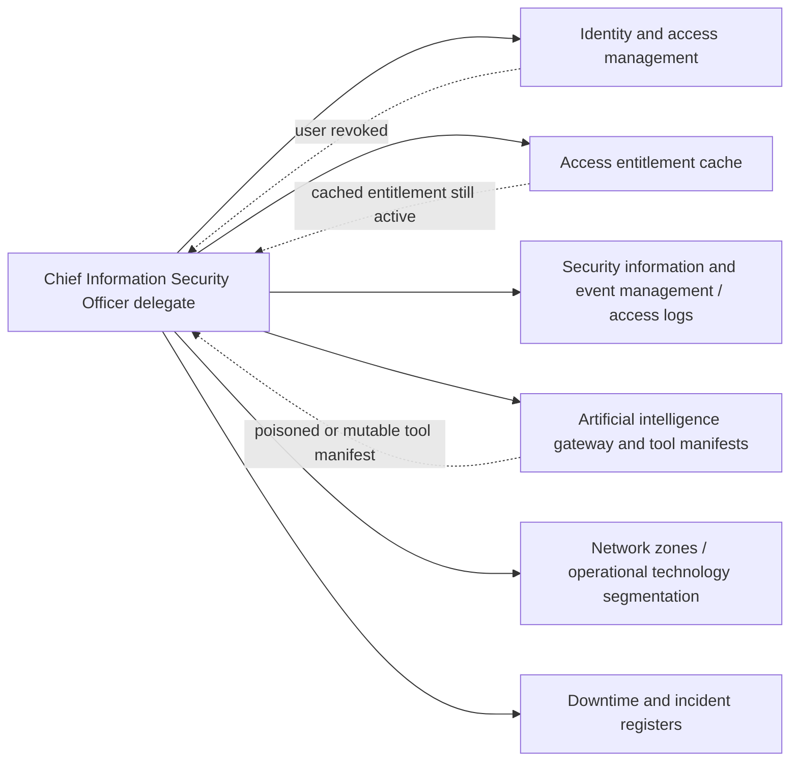
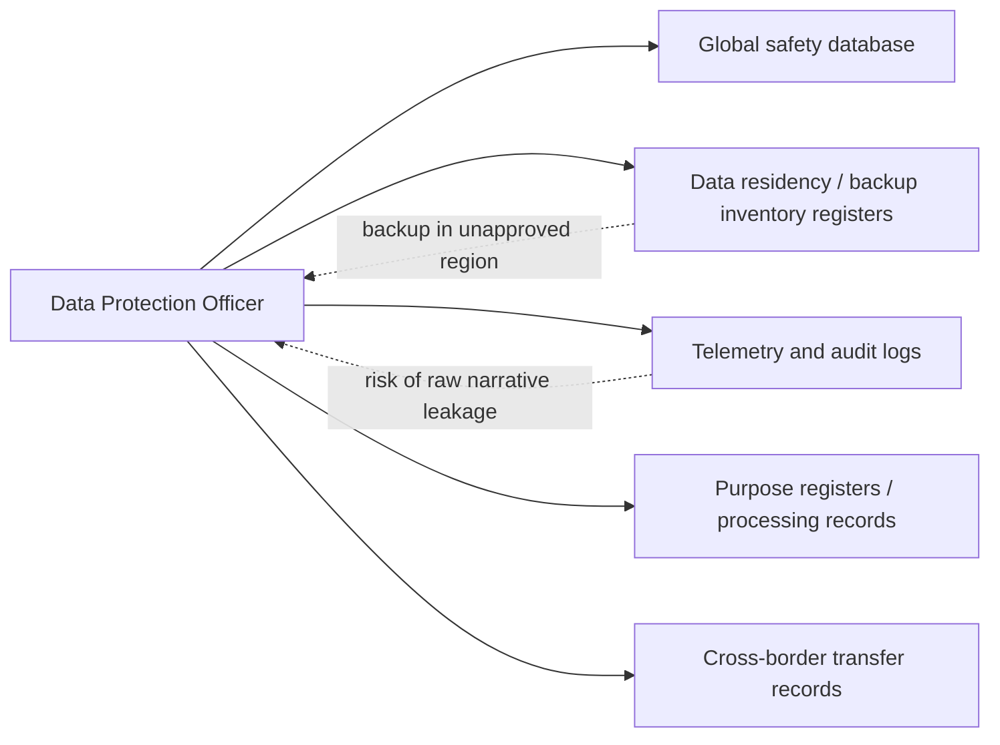
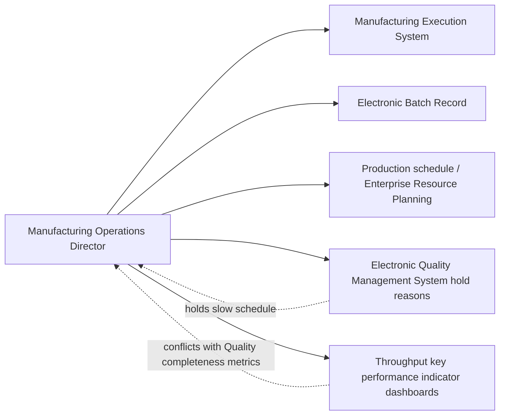
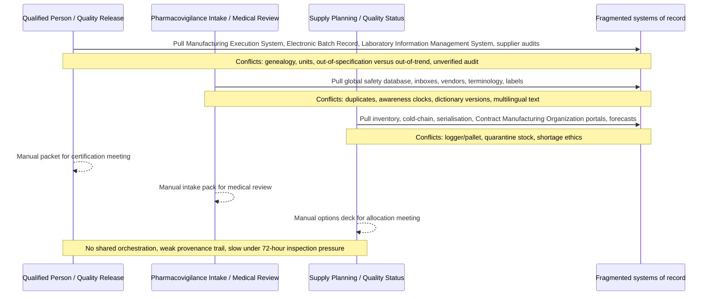

# 38 — Persona Examples & Current-State System Interaction Flows

| Field | Entry |
|---|---|
| Owner | Product / domain lead |
| Version / date | 1.0.0 / 2026-08-12 |
| Status | Phase 3 companion — current-state (as-is) persona and system map |
| Scope | **Current state before AEGIS** — fragmented systems of record; manual reconciliation |
| Sources | `case/STAKEHOLDER_PACK.md`, `case/SOURCE_SYSTEM_FACT_PACK.md`, `case/INTEGRATED_CASE.md`, `Docs/DDD-Lab/Phase 1/A1_Business_Problem_Framing.md`, `03_stakeholders_decision_rights.md`, `05_product_operating_model.md`, `PRD_AEGIS_Google_AI_Studio.md` |
| Naming rule | Prefer **full forms** in this artefact; avoid unexplained acronyms |

---

## 1. Purpose

Document **example personas** (designation + team) and **detailed current-state flows** showing which systems each persona interacts with today at NovaCura Therapeutics Group.

This artefact describes the **as-is** problem landscape that AEGIS later addresses as an advisory evidence orchestrator. It does **not** authorize AEGIS to perform regulated decisions.

---

## 2. Persona examples (designation and team)

Synthetic workshop personas — illustrative, not real individuals.

| Persona example | Designation | Team / function | Primary job today |
|---|---|---|---|
| **Elena Vargas** | European Union Qualified Person | Quality Release, Ireland site | Certify or hold biologics batch `NCB204-B24071` using a complete evidence pack |
| **James Okonkwo** | Quality Release Reviewer | Batch Review Coordination, Quality Operations | Assemble release packet: genealogy, laboratory results, supplier audits, deviations |
| **Priya Nair** | Pharmacovigilance Case Intake Coordinator | Global Pharmacovigilance Operations | Triage incoming safety cases; spot duplicates and awareness-date conflicts |
| **Dr. Markus Keller** | Pharmacovigilance Medical Reviewer | Global Pharmacovigilance Medical Review | Final seriousness, causality, expectedness, reportability, and signal decisions |
| **Sofia Almeida** | Supply Planning Lead | Global Supply Chain Planning | Option recovery for shortage and cold-chain events without executing allocation |
| **Tomás Rivera** | Quality Status Gatekeeper | Quality Operations (inventory status) | Approve whether stock is released, quarantine, or rejected before planning acts |
| **Aisha Rahman** | Regulatory Affairs Manager | Global Regulatory Affairs | Build 72-hour multi-agency inspection evidence package |
| **Chen Wei** | Chief Information Security Officer delegate | Cybersecurity and Resilience | Contain poisoned tools, revoked access, ransomware / degraded operations |
| **Laura Mendes** | Data Protection Officer | Privacy and Data Protection Office | Ensure purpose-bound retrieval and minimised personal data exposure |
| **Michael Brandt** | Manufacturing Operations Director | Manufacturing / Sterile Fill-Finish | Push throughput while holds and evidence gaps remain with Quality |

### 2.1 Stakeholder mandate summary (enterprise)

| Stakeholder role | Mandate | Decision authority (regulated) |
|---|---|---|
| Chief Quality Officer | Pharmaceutical quality system | Quality-system policy and risk acceptance |
| European Union Qualified Person | European Union batch certification | Final certification remains human-only |
| Global Head of Pharmacovigilance | Safety-system performance | Final safety decisions remain human-only |
| Supply Chain Vice President | Service continuity | Planning; regulated execution needs approvals |
| Regulatory Affairs Vice President | Global registrations | Submission strategy and authority interactions |
| Data Protection Officer | Lawful data processing | Privacy risk acceptance and escalation |
| Chief Information Security Officer | Cyber and resilience | Security controls and incident response |
| Manufacturing Vice President | Reliable supply | Operations; never independent batch release |
| Patient Safety Representative | Patient and participant voice | Advisory veto through safety governance |

---

## 3. Current-state pattern

Today each persona **manually hops across systems of record**. Nothing packages conflict-visible, provenance-backed evidence for them. Authority is contextual: a later timestamp is not automatically more trusted than a signed approved record.

### 3.1 Domain system catalogue (current state)

| Domain | Systems of record / tools | Known condition |
|---|---|---|
| Manufacturing | Enterprise Resource Planning; Manufacturing Execution System; Electronic Batch Record; process historian; Process Analytical Technology; warehouse management system | Genealogy breaks during downtime; vendor interfaces use different units |
| Laboratory | Laboratory Information Management System; Chromatography Data System; instrument personal computers; laboratory notebooks; spreadsheets | Shared accounts; inconsistent out-of-specification states; undocumented spreadsheets |
| Quality | Electronic Quality Management System; document management; training; supplier quality | Deviation taxonomies and effective documents inconsistent |
| Safety | Global safety database; affiliate inboxes; vendors; literature; call centre | Duplicate cases; versioned terminology; awareness dates conflict |
| Regulatory | Regulatory Information Management; Electronic Common Technical Document archive; labelling; Identification of Medicinal Products / Substances, Products, Organisations and Referentials staging | Product identities and commitments not synchronized |
| Supply | Serialisation; logistics; cold-chain; Contract Manufacturing Organization portals | Aggregation and logger association can be incomplete |
| Clinical (adjacent) | Electronic Data Capture; Clinical Trial Management System; electronic consent; Interactive Response Technology | Protocol and consent versions asynchronous; clocks differ |
| Artificial intelligence platform | Gateway; model endpoints; vector store; tools; evaluator | Bundled vendor; stale entitlements; mutable manifests; weak cost controls |

---

## 4. Flow — European Union Qualified Person and Quality Release Reviewer

**Examples:** Elena Vargas (European Union Qualified Person); James Okonkwo (Quality Release Reviewer)  
**Teams:** Quality Release / Batch Review Coordination  
**Current-state goal:** Decide batch certification with defensible evidence  
**Workshop objects:** Batch `NCB204-B24071`; genealogy lot `SUA-88`; public fixtures PUB-01 to PUB-03 class

```mermaid
flowchart TB
  subgraph People["People"]
    QP[European Union Qualified Person<br/>Elena Vargas]
    QR[Quality Release Reviewer<br/>James Okonkwo]
    LAB[Laboratory / Out-of-Specification owner]
    MFG[Manufacturing supervisor]
    SUPQ[Supplier Quality]
  end

  subgraph MfgSys["Manufacturing systems"]
    ERP[Enterprise Resource Planning]
    MES[Manufacturing Execution System]
    EBR[Electronic Batch Record]
    HIST[Process historian]
    PAT[Process Analytical Technology]
    WHS[Warehouse management system]
  end

  subgraph LabSys["Laboratory systems"]
    LIMS[Laboratory Information Management System]
    CDS[Chromatography Data System]
    IPC[Instrument personal computers]
    NB[Laboratory notebooks]
    SS[Undocumented spreadsheets]
    STAT[Statistical trend tooling]
  end

  subgraph QualSys["Quality systems"]
    EQMS[Electronic Quality Management System]
    DMS[Document management system]
    TRAIN[Training records system]
    SQ[Supplier quality module / audits]
    RP[Release packet checklist tools]
  end

  QR --> MES
  QR --> EBR
  QR --> WHS
  QR --> LIMS
  QR --> STAT
  QR --> NB
  QR --> EQMS
  QR --> SQ
  QR --> RP
  QR --> DMS

  LAB --> LIMS
  LAB --> CDS
  LAB --> NB
  LAB --> STAT
  MFG --> MES
  MFG --> EBR
  SUPQ --> SQ

  MES -.->|genealogy break: missing single-use assembly lot| QR
  WHS -.->|lot appears in warehouse consumption| QR
  LIMS -.->|marks assay out of specification| QR
  STAT -.->|marks same assay out of trend| QR
  NB -.->|labels result invalid| QR
  LIMS -.->|unit milligrams per litre| QR
  ERP -.->|interface assumes micrograms per millilitre| QR
  SQ -.->|unverified contract-site audit commitment| QR

  QR -->|manual reconciliation pack| QP
  QP -->|final certification or hold<br/>human only| EQMS
```

**Systems touched today:** Enterprise Resource Planning; Manufacturing Execution System; Electronic Batch Record; process historian; Process Analytical Technology; warehouse management; Laboratory Information Management System; Chromatography Data System; instrument personal computers; notebooks; spreadsheets; statistical tooling; Electronic Quality Management System; document management; training; supplier quality; release packet tools.

**Human-only outcome:** European Union Qualified Person certification / disposition — never automated.

---

## 5. Flow — Pharmacovigilance Case Intake Coordinator and Medical Reviewer

**Examples:** Priya Nair (Case Intake Coordinator); Dr. Markus Keller (Medical Reviewer)  
**Teams:** Global Pharmacovigilance Operations / Medical Review  
**Current-state goal:** Triage cases without losing clocks, duplicates, or multilingual meaning  
**Workshop objects:** Cases `PV-1001`, `PV-1009`, `PV-1014`; public fixtures PUB-04 to PUB-06 class

**Systems touched today:** Global safety database; affiliate inboxes; vendor portals; literature feeds; call centre capture; Medical Dictionary for Regulatory Activities tools; labelling / brochure repositories; product complaints; Electronic Quality Management System.

**Human-only outcomes:** Final seriousness, causality, expectedness, reportability, and signal confirmation — never automated.

---

## 6. Flow — Supply Planning Lead and Quality Status Gatekeeper

**Examples:** Sofia Almeida (Supply Planning Lead); Tomás Rivera (Quality Status Gatekeeper)  
**Teams:** Global Supply Chain Planning + Quality Operations  
**Current-state goal:** Recover from shortage / cold-chain dispute without unauthorized execution  
**Workshop objects:** Product `NCB-204` shortage; cold-chain / serialisation injects; public fixtures PUB-07 to PUB-08 class

**Systems touched today:** Inventory / warehouse; serialisation platform; cold-chain monitoring; transport management; Contract Manufacturing Organization portals; demand planning; allocation spreadsheets; Electronic Quality Management System; Enterprise Resource Planning inventory quality status.

**Human-only outcomes:** Allocation, reservation, shipment, inventory quality-status change, recall initiation — never automated.

---

## 7. Supporting persona flows

### 7.1 Regulatory Affairs Manager — Aisha Rahman · Global Regulatory Affairs

### 7.2 Chief Information Security Officer delegate — Chen Wei · Cybersecurity and Resilience

### 7.3 Data Protection Officer — Laura Mendes · Privacy and Data Protection Office

### 7.4 Manufacturing Operations Director — Michael Brandt · Manufacturing

---

## 8. Current-state swimlane — three primary workflows colliding

---

## 9. Decision rights reminder (current and future)

| Output / decision | Current accountable human | May artificial intelligence ever own this? |
|---|---|---|
| Batch certification / disposition | European Union Qualified Person / Quality | **No** |
| Final seriousness, causality, expectedness, reportability, signal | Pharmacovigilance Medical Review / Global Head of Pharmacovigilance | **No** |
| Allocation, shipment, inventory quality-status change, recall | Supply Planning + Quality approvals | **No** |
| Evidence packet assembly with conflicts visible | Today: manual by reviewers; future: AEGIS advisory support | Advisory only |

---

## 10. Forward link (future state — not this artefact’s scope)

**AEGIS Evidence Orchestrator** (see `PRD_AEGIS_Google_AI_Studio.md`, `05_product_operating_model.md`) sits later as a **read-only advisory layer**:

- Assembles conflict-visible packets for Batch, Pharmacovigilance intake, and Supply optioning  
- Requires human review gates before export  
- Never writes back to systems of record  
- Never replaces the European Union Qualified Person, Pharmacovigilance medical reviewer, or Supply / Quality execution approvals  

---

## 11. Traceability

| Related artefact | Use |
|---|---|
| `39_persona_to_workflow_e2e_flows.md` | **All personas mapped to Batch, Pharmacovigilance, and Supply workflows** with end-to-end flows |
| `03_stakeholders_decision_rights.md` | Decision rights |
| `05_product_operating_model.md` | Personas and jobs-to-be-done |
| `06_human_oversight_and_emergency_stop.md` | Human gates |
| `PRD_AEGIS_Google_AI_Studio.md` | Future product requirements |
| `case/SOURCE_SYSTEM_FACT_PACK.md` | System catalogue |
| `case/STAKEHOLDER_PACK.md` | Stakeholder mandates |

---

*End of artefact 38 — Persona examples and current-state system interaction flows.*
