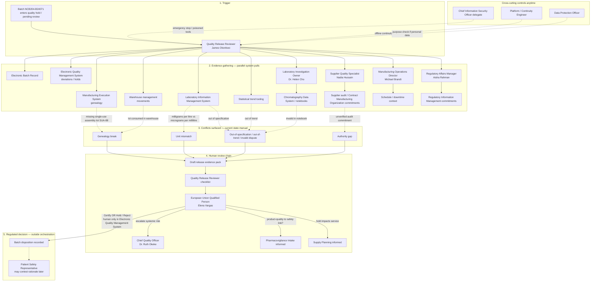
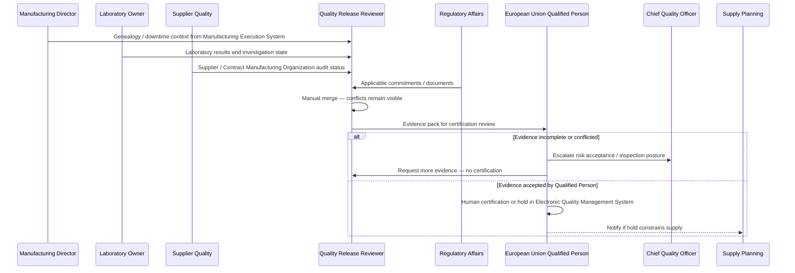
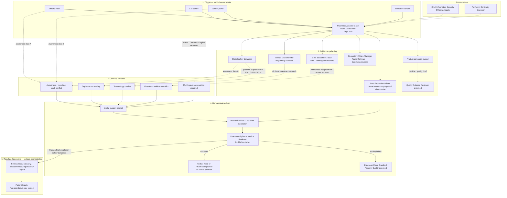
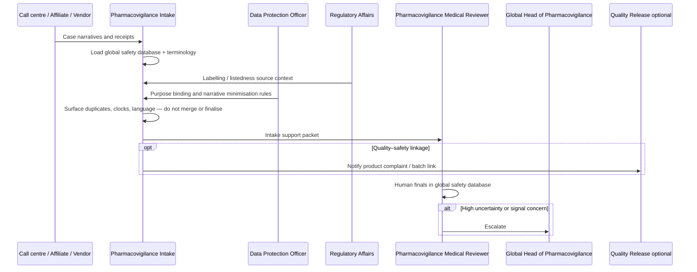
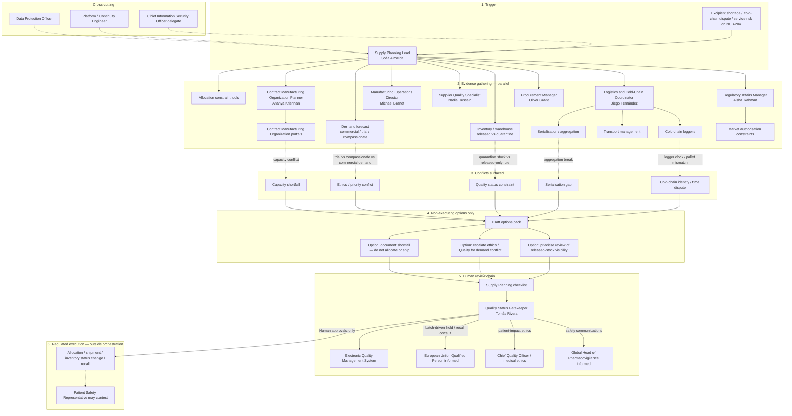
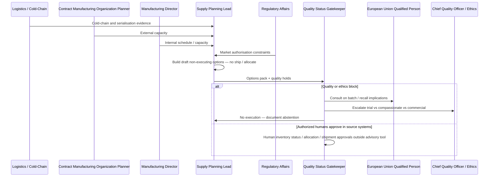
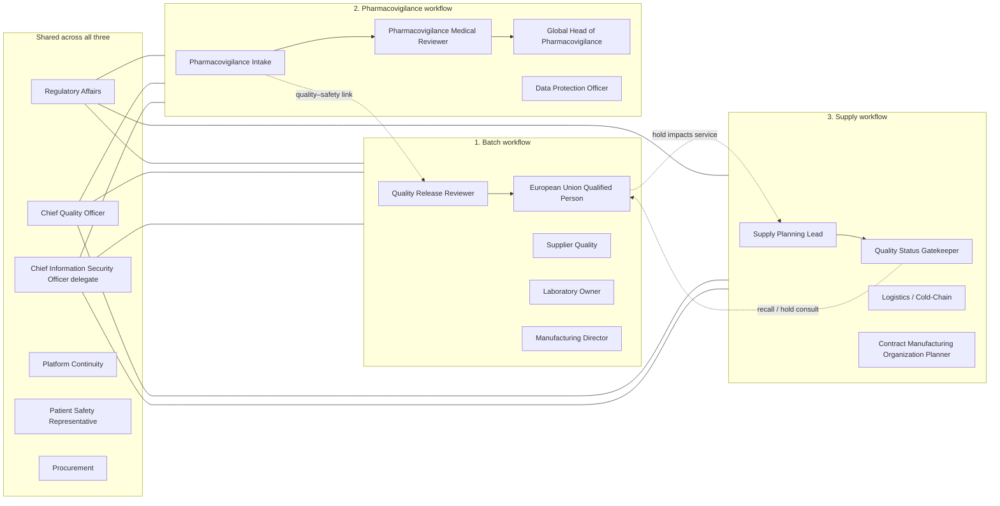

# 39 — All Personas Mapped to Batch, Pharmacovigilance, and Supply Workflows

| Field | Entry |
|---|---|
| Owner | Product / domain lead |
| Version / date | 1.0.0 / 2026-08-12 |
| Status | Phase 3 companion — persona × workflow end-to-end flows |
| Naming rule | Full forms preferred; avoid unexplained acronyms |
| Three mandatory workflows | **1. Batch evidence readiness** · **2. Pharmacovigilance intake support** · **3. Supply recovery optioning** |
| Note on “Supplier” | Supplier Quality is a **persona** inside Batch (and sometimes Supply). The third workflow is **Supply** (shortage / cold-chain recovery), not a separate “Supplier workflow”. |
| Sources | `38_persona_current_state_system_flows.md`, `03`, `05`, `06`, `case/STAKEHOLDER_PACK.md`, `case/SOURCE_SYSTEM_FACT_PACK.md`, `PRD_AEGIS_Google_AI_Studio.md` |

---

## 1. Purpose

Provide a **detailed end-to-end flow for each of the three mandatory workflows**, with **every persona** mapped as Primary, Supporting, Informed, or Out of lane — including designation, team, systems touched, and human-only decisions.

---

## 2. Master persona register

| Identifier | Name | Designation | Team |
|---|---|---|---|
| P-QP | Elena Vargas | European Union Qualified Person | Quality Release, Ireland site |
| P-QR | James Okonkwo | Quality Release Reviewer | Batch Review Coordination, Quality Operations |
| P-SQ | Nadia Hussain | Supplier Quality Specialist | Supplier Quality, Quality Operations |
| P-LAB | Dr. Helen Cho | Laboratory Investigation Owner | Analytical Laboratory / Out-of-Specification investigations |
| P-MFG | Michael Brandt | Manufacturing Operations Director | Manufacturing / Sterile Fill-Finish |
| P-INT | Priya Nair | Pharmacovigilance Case Intake Coordinator | Global Pharmacovigilance Operations |
| P-MED | Dr. Markus Keller | Pharmacovigilance Medical Reviewer | Global Pharmacovigilance Medical Review |
| P-PVH | Dr. Amira Soliman | Global Head of Pharmacovigilance | Global Pharmacovigilance Leadership |
| P-SP | Sofia Almeida | Supply Planning Lead | Global Supply Chain Planning |
| P-QG | Tomás Rivera | Quality Status Gatekeeper | Quality Operations (inventory status) |
| P-LOG | Diego Fernández | Logistics and Cold-Chain Coordinator | Global Logistics |
| P-CMO | Ananya Krishnan | Contract Manufacturing Organization Planner | External Manufacturing Coordination |
| P-RA | Aisha Rahman | Regulatory Affairs Manager | Global Regulatory Affairs |
| P-CQO | Dr. Ruth Okeke | Chief Quality Officer | Pharmaceutical Quality System leadership |
| P-SEC | Chen Wei | Chief Information Security Officer delegate | Cybersecurity and Resilience |
| P-DPO | Laura Mendes | Data Protection Officer | Privacy and Data Protection Office |
| P-PSR | Samira Ali | Patient Safety Representative | Patient and participant voice / safety governance |
| P-PRC | Oliver Grant | Procurement Manager | Procurement and vendor assurance |
| P-PLT | Kai Nakamura | Platform / Continuity Engineer | Digital Platform and Operations |

### 2.1 Persona × workflow participation matrix

| Persona | 1. Batch | 2. Pharmacovigilance | 3. Supply |
|---|---|---|---|
| European Union Qualified Person (Elena Vargas) | **Primary accountable** | Informed if product-quality / safety link | Informed if recall / quality hold |
| Quality Release Reviewer (James Okonkwo) | **Primary operator** | Supporting if complaint–batch link | Supporting on quality holds |
| Supplier Quality Specialist (Nadia Hussain) | **Supporting (supplier evidence)** | Rare | Supporting (Contract Manufacturing Organization / material constraints) |
| Laboratory Investigation Owner (Dr. Helen Cho) | **Supporting (laboratory evidence)** | Rare | Out of lane |
| Manufacturing Operations Director (Michael Brandt) | **Supporting / pressure for speed** | Out of lane | Supporting (capacity / schedule) |
| Pharmacovigilance Case Intake Coordinator (Priya Nair) | Informed if product complaint link | **Primary operator** | Out of lane |
| Pharmacovigilance Medical Reviewer (Dr. Markus Keller) | Informed if quality–safety link | **Primary accountable (finals)** | Out of lane |
| Global Head of Pharmacovigilance (Dr. Amira Soliman) | Escalation only | **Escalation / policy** | Escalation if shortage ethics / safety |
| Supply Planning Lead (Sofia Almeida) | Informed on holds affecting service | Out of lane | **Primary operator** |
| Quality Status Gatekeeper (Tomás Rivera) | Supporting on inventory status | Out of lane | **Primary gate (execution approvals)** |
| Logistics and Cold-Chain Coordinator (Diego Fernández) | Supporting if warehouse / distribution | Out of lane | **Supporting (cold-chain / serialisation)** |
| Contract Manufacturing Organization Planner (Ananya Krishnan) | Supporting (site capacity / genealogy) | Out of lane | **Supporting (capacity)** |
| Regulatory Affairs Manager (Aisha Rahman) | Supporting (commitments / inspection) | Supporting (labelling / listedness sources) | Supporting (market authorisation constraints) |
| Chief Quality Officer (Dr. Ruth Okeke) | Escalation / policy | Escalation | Escalation |
| Chief Information Security Officer delegate (Chen Wei) | Cross-cutting control | Cross-cutting control | Cross-cutting control |
| Data Protection Officer (Laura Mendes) | Light (batch data) | **Supporting (narratives / purpose)** | Light |
| Patient Safety Representative (Samira Ali) | Contestability | Contestability | Contestability |
| Procurement Manager (Oliver Grant) | Supporting (vendor / audit contracts) | Out of lane | Supporting (vendor exit / capacity contracts) |
| Platform / Continuity Engineer (Kai Nakamura) | Cross-cutting continuity | Cross-cutting continuity | Cross-cutting continuity |

---

## 3. Workflow 1 — Batch evidence readiness

| Field | Entry |
|---|---|
| Intent | Assemble conflict-visible evidence for batch review / European Union certification support |
| Public fixtures | PUB-01, PUB-02, PUB-03 |
| Example object | Biologics batch `NCB204-B24071` |
| Primary operator | Quality Release Reviewer (James Okonkwo) |
| Primary accountable decision | European Union Qualified Person (Elena Vargas) — **outside AEGIS** |
| AEGIS role (future) | Advisory packet only; `execution_status = not_executed` |
| Must never | Release, reject, reprocess, relabel, or recall a batch |

### 3.1 Persona roles in Batch

| Persona | Role in Batch flow | Systems they interact with |
|---|---|---|
| Quality Release Reviewer | Assembles evidence; runs reconciliation; prepares packet | Manufacturing Execution System; Electronic Batch Record; warehouse management; Laboratory Information Management System; Electronic Quality Management System; supplier quality; document management |
| European Union Qualified Person | Reviews pack; decides certification or hold | Electronic Quality Management System; release packet; cited Manufacturing / Laboratory extracts |
| Supplier Quality Specialist | Confirms supplier / Contract Manufacturing Organization audit commitments | Supplier quality module; vendor portals; audit reports |
| Laboratory Investigation Owner | Clarifies out-of-specification / out-of-trend / invalid states | Laboratory Information Management System; Chromatography Data System; notebooks; statistical tooling |
| Manufacturing Operations Director | Explains schedule / downtime / genealogy context; pressures cycle time | Manufacturing Execution System; Electronic Batch Record; Enterprise Resource Planning schedule |
| Regulatory Affairs Manager | Confirms registration / commitment applicability for release evidence | Regulatory Information Management; document management; labelling |
| Chief Quality Officer | Escalation on systemic risk / inspection posture | Pharmaceutical quality system dashboards; Electronic Quality Management System |
| Procurement Manager | Vendor contractual evidence for audits | Procurement contracts; vendor management |
| Logistics coordinator | Warehouse movement confirmation for genealogy | Warehouse management; serialisation if packing-related |
| Contract Manufacturing Organization Planner | Site genealogy / capacity clarifications | Contract Manufacturing Organization portals; Manufacturing Execution System extracts |
| Data Protection Officer | Rare; personal data in deviations if present | Purpose registers |
| Chief Information Security Officer delegate | If tool / access / ransomware degrades Manufacturing Execution System or Electronic Quality Management System | Identity and access management; incident registers |
| Platform engineer | Continuity / offline evidence path | Platform monitoring |
| Patient Safety Representative | Contests opaque rationale after the fact | Safety governance forum |
| Pharmacovigilance Intake / Medical Reviewer | Enter only if product-quality complaint links to batch | Global safety database; product complaints |
| Supply Planning / Quality Status Gatekeeper | Informed when hold blocks supply | Inventory quality status |

### 3.2 Detailed Batch end-to-end flow (all personas)

### 3.3 Batch sequence (persona swimlane)

---

## 4. Workflow 2 — Pharmacovigilance intake support

| Field | Entry |
|---|---|
| Intent | Prepare intake evidence: duplicates, clocks, terminology, listedness, multilingual preservation |
| Public fixtures | PUB-04, PUB-05, PUB-06 |
| Example objects | Cases `PV-1001`, `PV-1009`, `PV-1014` |
| Primary operator | Pharmacovigilance Case Intake Coordinator (Priya Nair) |
| Primary accountable finals | Pharmacovigilance Medical Reviewer (Dr. Markus Keller) — **outside AEGIS** |
| Escalation | Global Head of Pharmacovigilance (Dr. Amira Soliman) |
| Must never | Final seriousness, causality, expectedness, reportability, or signal confirmation |

### 4.1 Persona roles in Pharmacovigilance

| Persona | Role in Pharmacovigilance flow | Systems they interact with |
|---|---|---|
| Pharmacovigilance Case Intake Coordinator | Triage; assemble intake packet; preserve narratives | Global safety database; affiliate inboxes; vendor portals; call centre; literature feeds |
| Pharmacovigilance Medical Reviewer | Final medical / regulatory safety decisions | Global safety database; labelling / brochure sources |
| Global Head of Pharmacovigilance | Policy, escalation, system performance | Pharmacovigilance governance; metrics |
| Data Protection Officer | Purpose binding; minimisation of narratives / personal data | Purpose registers; residency; telemetry rules |
| Regulatory Affairs Manager | Listedness / labelling source authority | Labelling system; core data sheet; local label; investigator brochure |
| Quality Release / Qualified Person | Enter if product-quality complaint links to batch | Electronic Quality Management System; product complaints; batch history |
| Patient Safety Representative | Contestability of opaque intake / medical rationale | Safety governance forum |
| Chief Information Security Officer delegate | Access revocation / tool poisoning during case handling | Identity and access management; artificial intelligence gateway |
| Platform engineer | Continuity during outage of safety database region | Continuity runbooks |
| Chief Quality Officer | Joint escalation on quality–safety signals | Quality governance |
| Laboratory / Manufacturing / Supply personas | Generally out of lane unless quality–safety linkage | — |

### 4.2 Detailed Pharmacovigilance end-to-end flow (all personas)

### 4.3 Pharmacovigilance sequence (persona swimlane)

---

## 5. Workflow 3 — Supply recovery optioning

| Field | Entry |
|---|---|
| Intent | Produce **non-executing** recovery options under quality, ethics, cold-chain, and capacity constraints |
| Public fixtures | PUB-07, PUB-08 |
| Example objects | `NCB-204` shortage; cold-chain / serialisation disputes |
| Primary operator | Supply Planning Lead (Sofia Almeida) |
| Primary execution gate | Quality Status Gatekeeper (Tomás Rivera) — **outside AEGIS** |
| Must never | Allocate, reserve, ship, change inventory quality status, or initiate recall without authorized human approval |

### 5.1 Persona roles in Supply

| Persona | Role in Supply flow | Systems they interact with |
|---|---|---|
| Supply Planning Lead | Builds option set; documents constraints | Demand planning; inventory; allocation tools; Contract Manufacturing Organization portals |
| Quality Status Gatekeeper | Approves any quality-status or release-to-ship path | Electronic Quality Management System; inventory quality status in Enterprise Resource Planning / warehouse |
| Logistics and Cold-Chain Coordinator | Logger / pallet / transport evidence | Cold-chain monitoring; serialisation; transport management |
| Contract Manufacturing Organization Planner | Capacity and external site constraints | Contract Manufacturing Organization portals |
| Manufacturing Operations Director | Internal capacity / schedule | Manufacturing Execution System; Enterprise Resource Planning schedule |
| European Union Qualified Person / Quality Release | Informed if batch hold drives shortage; recall consultation | Electronic Quality Management System; batch status |
| Supplier Quality Specialist | Material / supplier constraint evidence | Supplier quality; vendor portals |
| Regulatory Affairs Manager | Market authorisation / distribution constraints | Regulatory Information Management; registrations |
| Global Head of Pharmacovigilance / Medical | Ethics input for trial vs compassionate vs commercial | Medical / ethics forums |
| Procurement Manager | Vendor capacity contracts / exit terms | Procurement systems |
| Chief Quality Officer | Escalation on patient-impacting allocation ethics | Quality governance |
| Patient Safety Representative | Contestability of opaque allocation rationale | Safety governance |
| Data Protection Officer | Light touch unless patient-level logistics data | Purpose registers |
| Chief Information Security Officer delegate / Platform | Continuity and stop controls | Security / platform tooling |
| Pharmacovigilance Intake | Out of lane unless shortage links to safety communications | — |

### 5.2 Detailed Supply end-to-end flow (all personas)

### 5.3 Supply sequence (persona swimlane)

---

## 6. Cross-workflow persona map (one view)

---

## 7. Human review gates by workflow

| Gate | Batch | Pharmacovigilance | Supply |
|---|---|---|---|
| Pre-export packet | Quality Release / Qualified Person delegate | Pharmacovigilance Intake lead | Supply Planning Lead |
| Authority unresolved | Quality or Regulatory Affairs | Quality or Regulatory Affairs | Quality or Regulatory Affairs |
| Abstention override | Workflow owner + Quality | Workflow owner + Quality | Workflow owner + Quality |
| Security poisoned tool | Chief Information Security Officer delegate | Same | Same |
| Multilingual narrative | — | Pharmacovigilance Intake (+ Data Protection Officer if needed) | — |
| Non-executing options | — | — | Supply Planning + Quality Status Gatekeeper |

---

## 8. What each workflow must never automate

| Workflow | Prohibited autonomous outcomes |
|---|---|
| Batch | Release, reject, reprocess, relabel, recall |
| Pharmacovigilance | Final seriousness, causality, expectedness, reportability, signal confirmation |
| Supply | Allocate, reserve, ship, change inventory quality status, initiate recall |

---

## 9. Traceability

| Artefact | Relationship |
|---|---|
| `38_persona_current_state_system_flows.md` | Persona examples and current-state system diagrams |
| `03_stakeholders_decision_rights.md` | Decision rights |
| `05_product_operating_model.md` | Jobs-to-be-done |
| `06_human_oversight_and_emergency_stop.md` | Gates |
| `PRD_AEGIS_Google_AI_Studio.md` | Future advisory product |
| `13_requirements_traceability_matrix.md` | BAT / PV / SUP requirements |

---

*End of artefact 39 — All personas mapped to Batch, Pharmacovigilance, and Supply workflows.*
