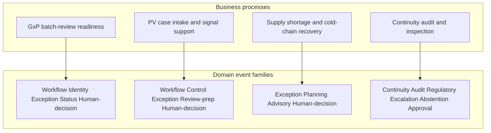
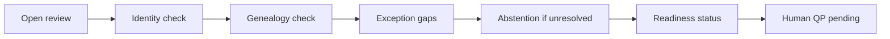
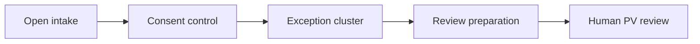
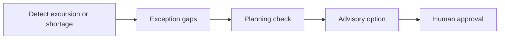
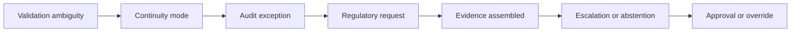
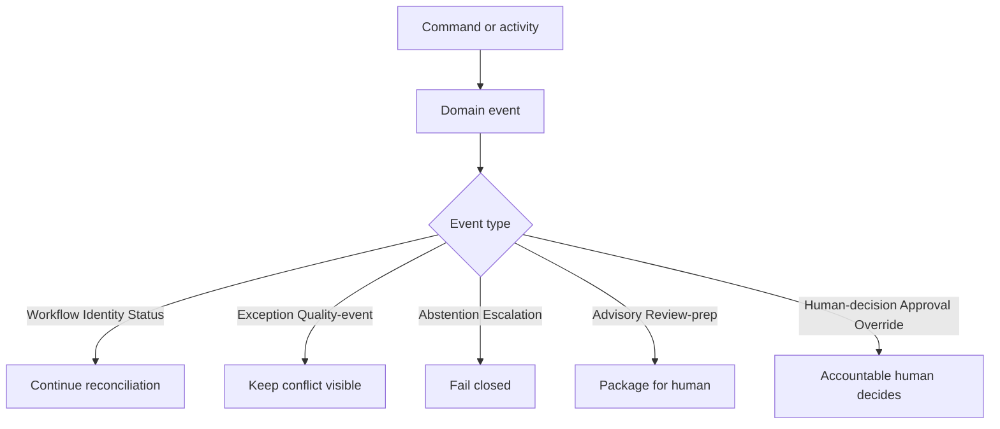

# Event Storming — Process to Event Map (A6)

| Field | Entry |
|---|---|
| Owner | Domain / architecture lead |
| Version / date | 1.1.0 / 2026-08-16 |
| Purpose | Leadership view — which **processes** emit which **domain events** |
| Source | [`Docs/DDD-Lab/Phase 6/A6_Event_Storming_Board.md`](../../Docs/DDD-Lab/Phase%206/A6_Event_Storming_Board.md) |
| Related | [`08_ddd_context_map.md`](../08_ddd_context_map.md) |

**Headline:** Event storming maps business processes to domain events — not system APIs and not specific batch IDs.

**Rule from A6:** Events are things that happened in the workflow. Conflicts stay visible. Regulated decisions stay human-owned.

---

## 1. Event types used on the board

| Event type | Meaning | Typical process |
|---|---|---|
| **Workflow** | A regulated-adjacent review or intake starts | Open batch review; open PV intake |
| **Identity** | Product / batch / material identity or genealogy checked | Verify identity; request lineage |
| **Evidence** | Supporting record found or package assembled | Search warehouse; assemble inspection pack |
| **Exception** | Conflict or gap surfaces — remains visible | Unit clash; duplicate ICSRs; cold-chain dispute |
| **Abstention** | Required state unresolved — no-answer | Unresolved unit / identity / authority |
| **Quality-event** | Manufacturing / lab quality signal | Environmental excursion |
| **Correction** | Prior finding corrected with rationale | Organism ID correction |
| **Supplier-evidence** | Supplier audit / commitment work | Verify audit commitment |
| **Status** | Readiness or completeness assessed | Assess batch-review readiness |
| **Control** | Privacy / entitlement gate | Consent check |
| **Review / review-preparation** | Material prepared for human review | Clock pack; multilingual review; PV case pack |
| **Planning** | Constraints evaluated for options | Allocation constraint check |
| **Advisory** | Draft option proposed — not executed | Supply recovery option |
| **Human-decision** | Accountable human must decide | QP pending; allocation approval requested |
| **Continuity** | Degraded or AI-off operation | Repair window; AI-off mode |
| **Audit** | Audit envelope captured | Capture audit event |
| **Regulatory** | Inspection / agency request | Receive multi-agency request |
| **Escalation** | Unresolved state escalated | Escalate evidence gap |
| **Approval / override** | Human decision recorded | Record approval or override |

---

## 2. Big picture — process lanes → event families

---

## 3. Process: GxP batch-review readiness

**Purpose:** Prepare conflict-visible evidence so Quality / EU QP can assess review readiness — not certify or release.

| Process step (command) | Domain event generated | Event type |
|---|---|---|
| Open batch review | Batch review opened | Workflow |
| Verify batch and product identity | Batch identity and product-master state checked | Identity |
| Request lineage check | Genealogy check requested | Identity |
| Detect missing lineage branch | Genealogy branch gap detected | Exception |
| Search warehouse consumption | Contradictory consumption record found | Evidence |
| Compare reported vs assumed units | Unit-conversion conflict detected | Exception |
| Abstain on unresolved unit | Unit-conversion state declared unresolved | Abstention |
| Surface conflicting result states | OOS / OOT / notebook disagreement surfaced | Exception |
| Report environmental excursion | Sterile-area excursion detected | Quality-event |
| Correct organism identification | Organism identification corrected | Correction |
| Request supplier-audit verification | Supplier-audit commitment verification requested | Supplier-evidence |
| Check commitment verification | Supplier-audit commitment found unverified | Exception |
| Detect back-entered record | Back-entered batch-record step detected | Exception |
| Assess release-packet completeness | Release packet marked evidence-incomplete | Exception |
| Assess batch-review readiness | Readiness assessed with unresolved gaps | Status |
| Prepare evidence for QP | QP certification decision pending | Human-decision |

**Must never generate:** release, reject, reprocess, relabel, recall, or QP certification as an automated outcome.

---

## 4. Process: PV case intake and signal support

**Purpose:** Support intake and prepare review material — not make final safety decisions.

| Process step (command) | Domain event generated | Event type |
|---|---|---|
| Open PV case intake | PV case intake opened | Workflow |
| Validate consent and entitlement | Consent / entitlement check requested | Control |
| Detect duplicate candidates | ICSR duplicate cluster identified | Exception |
| Reconstruct reporting clock | Awareness-date dispute surfaced | Exception |
| Align terminology versions | MedDRA preferred-term conflict surfaced | Exception |
| Compare listedness sources | Listedness conflict surfaced | Exception |
| Prepare clock evidence | Reporting-clock evidence prepared | Review-preparation |
| Request multilingual review | Multilingual review requested | Review |
| Prepare case-review material | Case-review material prepared | Review-preparation |

**Must never generate:** final seriousness, causality, expectedness, reportability, or signal confirmation.

---

## 5. Process: Supply shortage and cold-chain recovery

**Purpose:** Reconstruct evidence and draft policy-bounded options — not execute allocation or shipment.

| Process step (command) | Domain event generated | Event type |
|---|---|---|
| Detect temperature excursion | Cold-chain excursion detected | Exception |
| Detect aggregation gap | Case-to-pallet aggregation gap detected | Exception |
| Check aggregation hierarchy | Serialisation aggregation gap detected | Exception |
| Surface shortage | Excipient shortage surfaced | Exception |
| Surface capacity conflict | CMO capacity conflict surfaced | Exception |
| Check allocation constraints | Allocation constraint check completed | Planning |
| Generate traceable options | Allocation option proposed awaiting approval | Advisory |
| Request authorised approval | Human approval requested for allocation option | Human-decision |

**Must never generate:** inventory status change, reservation, allocation, shipment, or recall initiation without explicit human approval.

---

## 6. Process: Continuity, audit, and inspection

**Purpose:** Keep work auditable and operable under degradation; assemble inspection evidence without inventing facts.

| Process step (command) | Domain event generated | Event type |
|---|---|---|
| Check validation state | Validation state found ambiguous | Exception |
| Open repair window | Master-data repair window opened | Continuity |
| Capture audit event | Audit record captured | Audit |
| Detect audit-capture gap | Audit-capture gap detected | Exception |
| Activate AI-off operation | AI-off continuity mode activated | Continuity |
| Receive multi-agency request | Inspection evidence request received | Regulatory |
| Assemble evidence package | Evidence package assembled for inspection | Evidence |
| Escalate unresolved state | Escalation created | Escalation |
| Abstain on unresolved state | No-answer abstention declared | Abstention |
| Record human approval | Human approval recorded | Approval |
| Record human override | Human override recorded | Override |

---

## 7. Cross-process pattern (all lanes)

| If the process is… | Expect these event types |
|---|---|
| Starting a review | Workflow |
| Checking who / what / lineage | Identity, Evidence |
| Finding disagreement | Exception, Quality-event, Correction |
| Cannot resolve safely | Abstention, Escalation |
| Preparing for a person | Review-preparation, Advisory, Status |
| A regulated act | Human-decision, Approval, Override only |
| Operating under stress | Continuity, Audit, Regulatory |

---

## 8. One-slide leave-behind

| Process | Events generated (families) | Ends with |
|---|---|---|
| **Batch-review readiness** | Workflow → Identity → Exception → Abstention → Status | Human-decision (QP pending) |
| **PV intake support** | Workflow → Control → Exception → Review-preparation | Human PV review |
| **Supply recovery planning** | Exception → Planning → Advisory | Human-decision (approval) |
| **Continuity & inspection** | Continuity → Audit → Regulatory → Evidence → Escalation / Abstention | Approval / override |

**Speaker line:** Event storming answers *what happens in each process* and *what kind of event is emitted*. Specific product or batch instances belong in fixtures — not on the leadership process map.
