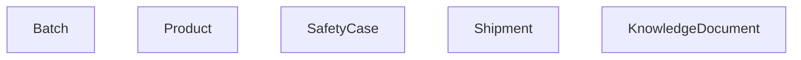
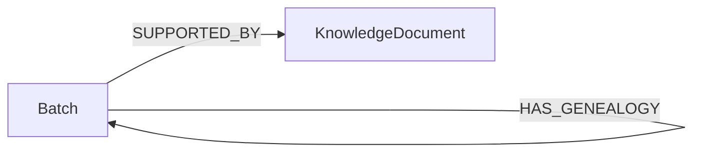
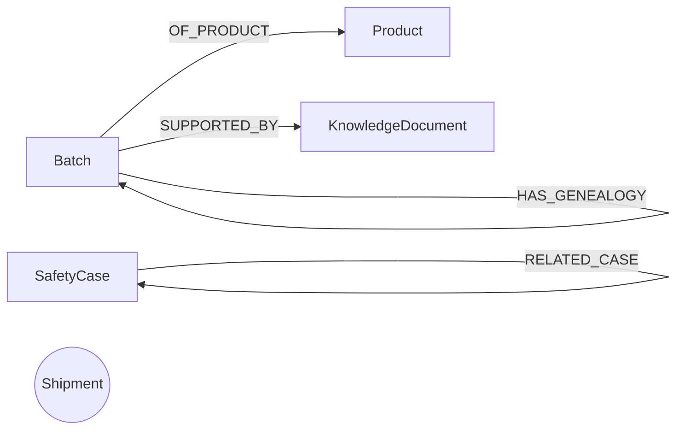
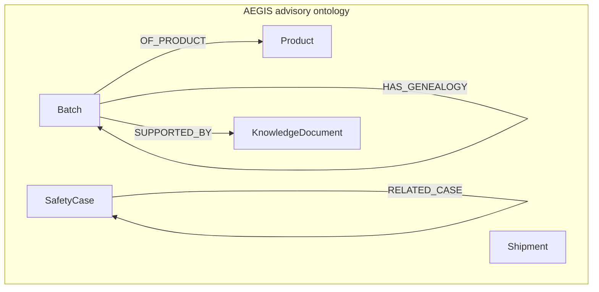
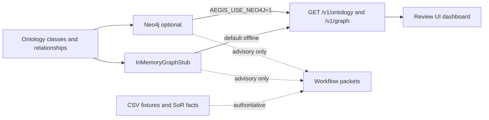
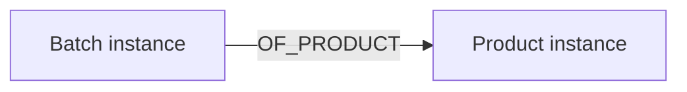
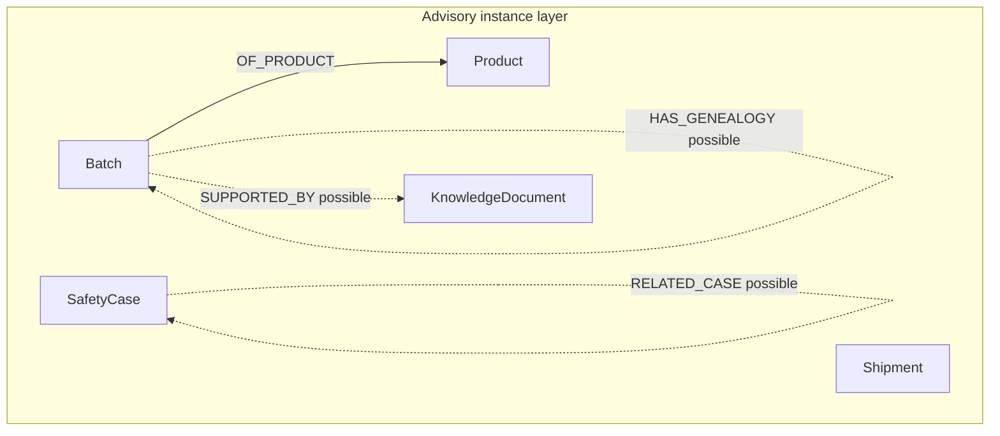
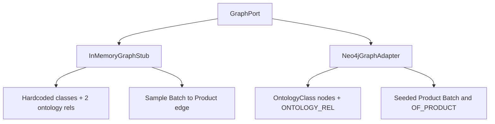

# Ontology & Knowledge Graph — Pictorial View

| Field | Entry |
|---|---|
| Owner | Architecture / data lead |
| Version / date | 1.0.0 / 2026-08-16 |
| Purpose | Executive / defence pictorial of AEGIS ontology + advisory KG |
| Code source | [`graph_memory.py`](../../src/aegis/adapters/graph_memory.py), [`graph_neo4j.py`](../../src/aegis/adapters/graph_neo4j.py), [`load_graph.py`](../../scripts/load_graph.py) |
| Design source | [`10_ontology_semantic_layer.md`](../10_ontology_semantic_layer.md), [`11_knowledge_graph_decision.md`](../11_knowledge_graph_decision.md) |

**Headline:** Five ontology classes. Advisory graph only. CSV / fixtures remain the system of record.

**How to use:** Paste Mermaid into slides, or render in Markdown preview / Mermaid Live.

---

## 1. Ontology classes (hardcoded)



| Class | Meaning (semantic layer) |
|---|---|
| **Batch** | Manufactured batch / lot under review |
| **Product** | Medicinal product identity |
| **SafetyCase** | ICSR / safety case aggregate |
| **Shipment** | Cold-chain / logistics unit |
| **KnowledgeDocument** | Controlled policy / SOP / labeled knowledge |

---

## 2. Ontology relationships (class level)

### 2.1 What the in-memory stub exposes via `list_ontology()`



| Relationship | From | To | Meaning |
|---|---|---|---|
| `HAS_GENEALOGY` | Batch | Batch | Parent / child or lineage link between batches or lots |
| `SUPPORTED_BY` | Batch | KnowledgeDocument | Batch evidence supported by a governed document |

### 2.2 Full advisory ontology used for Neo4j seed / empty-seed UI



| Relationship | From | To | Meaning |
|---|---|---|---|
| `HAS_GENEALOGY` | Batch | Batch | Lineage / genealogy edge |
| `OF_PRODUCT` | Batch | Product | Batch belongs to product |
| `SUPPORTED_BY` | Batch | KnowledgeDocument | Document supports batch evidence |
| `RELATED_CASE` | SafetyCase | SafetyCase | Possible duplicate / linked safety cases |

`Shipment` is a class in the ontology; no class-level edge is hardcoded for it in the seed plan (instances may still appear in a fuller projection later).

---

## 3. Ontology as one picture (recommended slide)



**Talk track:** Ontology answers *what kinds of things exist* and *how they may relate*. It does not decide release, PV finals, or allocation.

---

## 4. Knowledge graph — how it sits in the architecture



| Rule | Meaning |
|---|---|
| Advisory | Every graph response includes `advisory: true` |
| SoR wins | On conflict, prefer CSV / fixture values; rebuild graph |
| No write-back | Graph does not update MES / LIMS / QMS / PV DB |
| Offline first | Default adapter is the in-memory stub |

---

## 5. Knowledge graph — sample instance projection (seed)

Illustrative instance graph seeded for demo explainability (not a full SoR dump):



In code the seed uses one product and one batch node linked by `OF_PRODUCT`. Genealogy and document links are available as **relationship types** even when sample instance edges for those types are not populated in the stub.



Solid = seeded sample edge. Dashed = ontology allows the relationship; instance may be empty until loaded.

---

## 6. Stub vs Neo4j (same ontology, different store)



| | In-memory stub | Neo4j |
|---|---|---|
| Library | None (dicts) | `neo4j` Python driver + Neo4j 5 |
| Ontology API | Hardcoded dict | Cypher over `:OntologyClass` |
| Default | Yes | Only if `AEGIS_USE_NEO4J=1` |
| Mode flag | `in_memory_stub` | `neo4j` / `neo4j_empty_seed_view` / `neo4j_unavailable` |

---

## 7. One-slide leave-behind

```text
                    Product
                       ^
                       | OF_PRODUCT
                       |
    HAS_GENEALOGY   Batch ----SUPPORTED_BY----> KnowledgeDocument
         |  ^
         +--+

    SafetyCase ----RELATED_CASE----> SafetyCase

    Shipment   (class present; no hardcoded class-level edge)
```

**Libraries:** no RDF/OWL; optional Neo4j only.  
**Use:** explainability and UI ontology panel — not regulated decisions.
